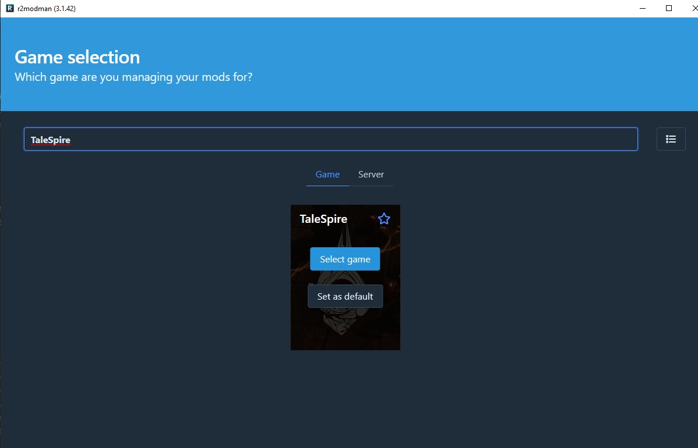
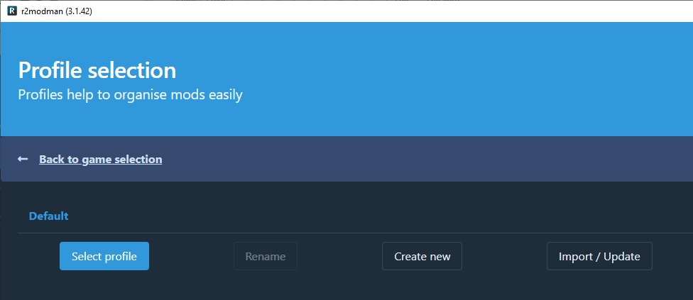
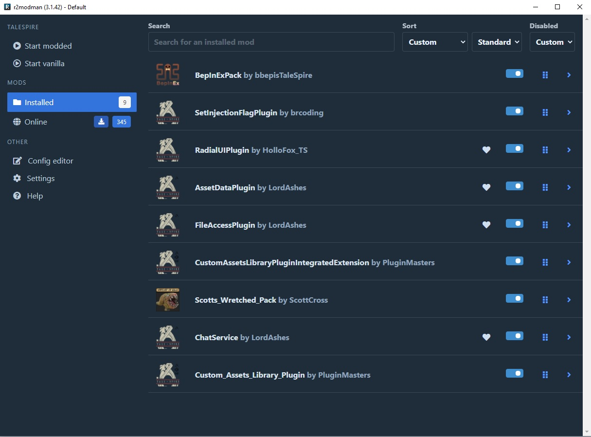
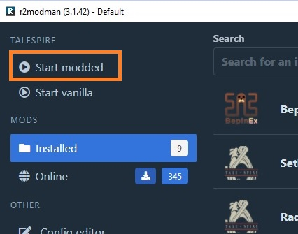
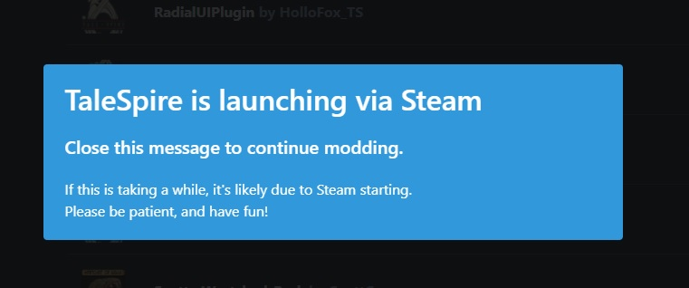
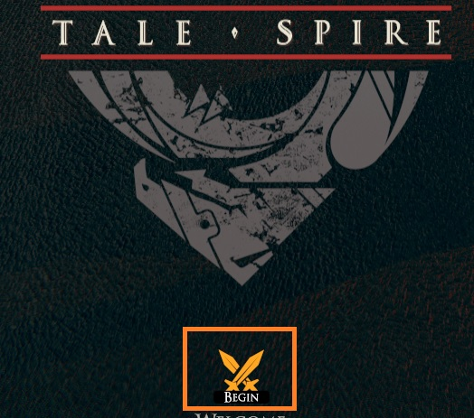
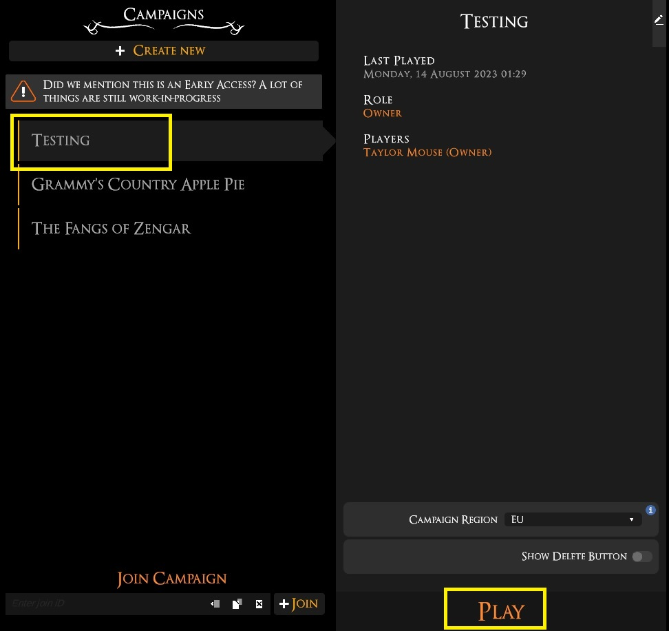
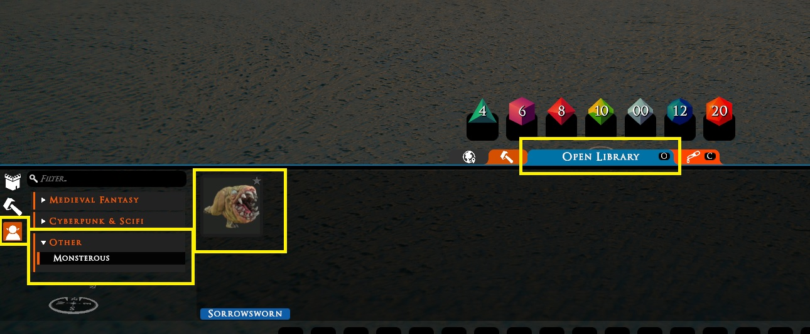

# TaleSpire Custom Models

## Pre- Requisites

Download and install the following:

NOTE: TaleSpire costs, at the time of writing 20€

- A version of [TaleSpire](https://store.steampowered.com/app/720620/TaleSpire/)
- [Unity3D version 2019.4.21f1](https://unity.com/releases/editor/whats-new/2019.4.21)
- [Blender](https://www.blender.org/download/)
- [R2ModMan](https://thunderstore.io/package/download/ebkr/r2modman/3.1.42/)
- [TaleSpire-HumanSize-Reference.obj](Resources/TaleSpire-HumanSize-Reference.obj)
- [BuildAssetBundle.cs](Resources/BuildAssetBundle.cs)

### TaleSpire

A Virtual Table Top game engine to play games like D&D. For more information about TaleSpire go to the official TaleSpire [website](https://talespire.com/).

###  Unity3D

Unity3D is a game development environment, the game TaleSpire was created using the 2019.4.21f1 version. So the idea is that the custom resources build in that version, can be used in TaleSpire. 
For more information about Unity3D go to the Unity3D [website](https://unity.com/)

### Blender

Blender is a free 3D modeling/sculpting program for community use. This is not required, you can use any 3D program that results in the same objects required for the model to work.
For more information about Blender, go the [website](https://www.blender.org/)

### R2ModMan

A tool created specifically to make modding happen in games.
For more information about R2ModMan or to make sure you download the latest version use this [link](https://thunderstore.io/package/ebkr/r2modman/)

### TaleSpire-HumanSize-Reference.obj

A 3D model (box) that represents the size of a mini in game, this references a 1 inch miniature with the size of a human.
In the tutorial we will use this to scale our model accordingly.

### BuildAssetBundle.cs

This piece of script will allow us to package our custom mini so we can use it in TaleSpire.

## Setting up the tools.

### Requirements
You have  TaleSpire and R2ModMan installed.

### Configure R2RodMan

To make sure everything will work we need to install some plugins for R2ModMan.

Open R2ModMan and select TaleSpire from the Game Selection overview:


In the Profile selection, press the Select profile button.


Under MODS, Online, you will find a lot of plugins you can install. For this tutorial, the following MODS are required.

- BepInExPack by bbepisTaleSpire
- SetIngectionFlagPlug by brcoding
- RadialUIPlugin by HollowFox_TS
- AssetDataPlugin by LordAshes
- FileAccessPlugin by LordAses
- CustomAssetsLibraryPluginINtegratedExtension by PluginMasters
- ChatService by LordAshes
- Custom_Assets_Library_Plugin by PluginMasters

Finally, before we create anything custom, we want to test this setup, so optionally, install this custom MOD as well:

- Scotts_Wretched_Pack by ScottCross

If you have correctly installed these MODS, your R2ModMan should look like this:



### Configure BepInEx

BepInEx was installed using the previous step, however, we still need to make a change to its config file.

Navigate to:

```cmd
C:\Users\<USERNAME>\AppData\Roaming\r2modmanPlus-local\TaleSpire\profiles\Default\BepInEx\config\
```
NOTE: put your username in the <USERNAME> field !

Open the file ```BepInEx.cfg``` and change the HideManagerGameObject configuration from ```false``` to ```true```

```conf

[Chainloader]
## If enabled, hides BepInEx Manager GameObject from Unity.
## This can fix loading issues in some games that attempt to prevent BepInEx from being loaded.
## Use this only if you know what this option means, as it can affect functionality of some older plugins.
## 
# Setting type: Boolean
# Default value: false

HideManagerGameObject = true

```

### Test the setup

To validate the steps taken, press the Start modded button. 


This will start TaleSpire via Steam.



In TaleSpire, press the BEGIN button.



Then create a new map/game/campaign or press the play button to start.
This will bring up an empty environment.



For more informaton on how to get started with TaleSpire, please use the official documentation.

For now, press the Spacebar to open the menu and click on Open Library. 

On the left bottom, select the little goblin (Creature Library) and at the bottom, you should notice a Other section, with a Monsterous group, in there you will see the Sorrowsworn beast.




C:\Users\<USERNAME>\AppData\Roaming\r2modmanPlus-local\TaleSpire\profiles\Default\BepInEx\plugins\[LocalContent]